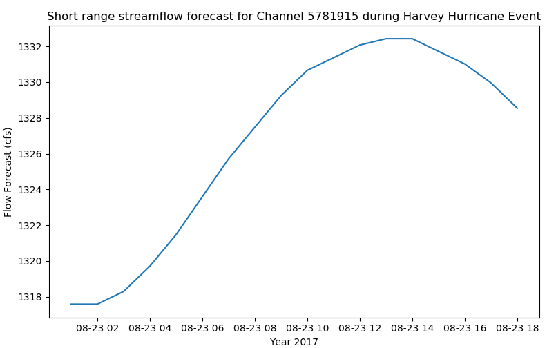

pymt_nwm converts `nwm <https://nwm.readthedocs.io/en/latest/?badge=latest>`_ into a reusable,
plug-and-play data component for `PyMT <https://pymt.readthedocs.io/en/latest/?badge=latest>`_ modeling framework.
pymt_nwm allows the National Water Model datasets to be easily coupled with other datasets or models that expose
a `Basic Model Interface <https://bmi.readthedocs.io/en/latest/>`_.

Installation
------------

Install the pymt in a new environment:

.. code::

  $ conda config --add channels conda-forge
  $ conda create -n pymt -c conda-forge python=3 pymt
  $ conda activate pymt

Install the pymt_nwm using pip:

.. code::

  $ pip install pymt_nwm

Coding Example
--------------

.. code-block:: python

    import matplotlib.pyplot as plt
    import numpy as np
    import cftime

    from pymt.models import Nwm

    # initiate a data component
    data_comp = Nwm()
    data_comp.initialize('config_file.yaml')

    # get variable info
    var_name = data_comp.output_var_names[0]
    var_unit = data_comp.var_units(var_name)
    var_location = data_comp.var_location(var_name)
    var_type = data_comp.var_type(var_name)
    var_grid = data_comp.var_grid(var_name)

    print('variable_name: {} \nvar_unit: {} \nvar_location: {} \nvar_type: {} \nvar_grid: {}'.format(
        var_name, var_unit, var_location, var_type, var_grid))

    # get time info
    start_time = data_comp.start_time
    end_time = data_comp.end_time
    time_step = data_comp.time_step
    time_units = data_comp.time_units
    time_steps = int((end_time - start_time)/time_step) + 1

    print('start_time: {} \nend_time: {} \ntime_step: {} \ntime_units: {} \ntime_steps: {}'.format(
        start_time, end_time, time_step, time_units, time_steps))

    # get variable data
    stream_array = np.empty(time_steps)
    cftime_array = np.empty(time_steps)

    for i in range(0, time_steps):
        stream_array[i] = data_comp.get_value(var_name)
        cftime_array[i] = data_comp.time
        data_comp.update()

    time_array = cftime.num2date(cftime_array, time_units, only_use_cftime_datetimes=False, only_use_python_datetimes=True )

    # plot data
    plt.figure(figsize=(9,5))
    plt.plot(time_array, stream_array)
    plt.xlabel('Year 2017')
    plt.ylabel('{} ({})'.format(var_name, var_unit))
    plt.title('Short range streamflow forecast for Channel 5781915 during Harvey Hurricane Event')

    # complete the example by finalizing the component
    data_comp.finalize()

|ts_plot|

.. links:

.. |binder| image:: https://mybinder.org/badge_logo.svg
 :target: https://mybinder.org/v2/gh/gantian127/pymt_soilgrids/master?filepath=notebooks%2Fpymt_soilgrids.ipynb

